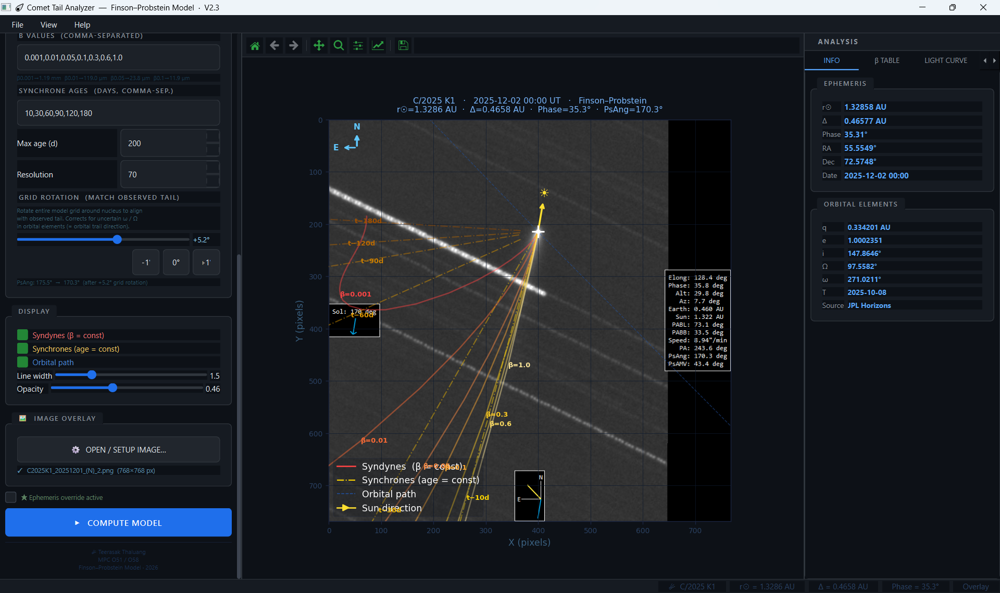
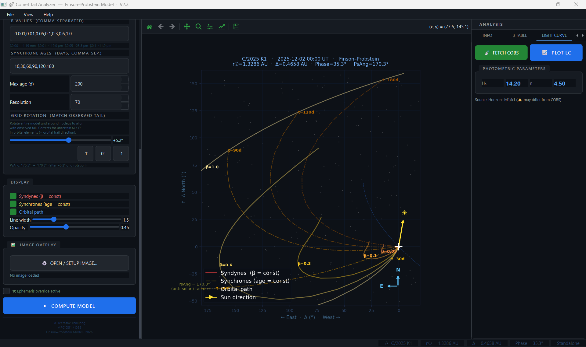
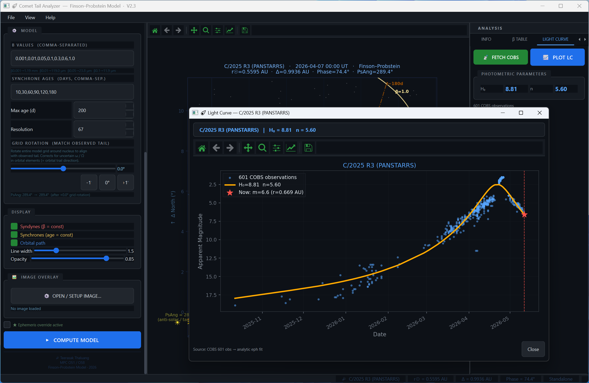
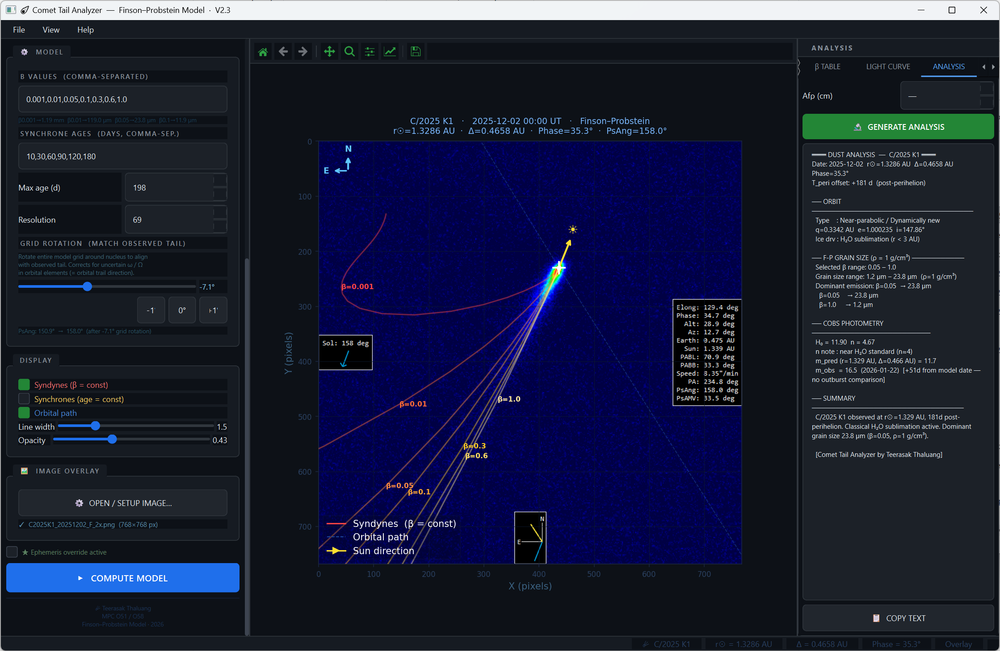

# ☄ Comet Tail Analyzer — Finson–Probstein Model

<p align="center">
  
</p>

<p align="center">
  <a href="https://github.com/yourusername/comet-tail-analyzer/releases"></a>
  <a href="LICENSE"></a>
  
  
  
</p>

A professional desktop application for modelling cometary dust tails using the **Finson–Probstein (1968)** syndyne–synchrone framework. Built for active observers and researchers, it combines orbital mechanics, real-time ephemeris fetching, photometric light curves, and image overlay — all in a single PyQt6 GUI.

---

## ✨ Features

| Category | Capability |
|---|---|
| **Dust Tail Model** | Full Finson–Probstein syndyne/synchrone grid with configurable β values and synchrone ages |
| **Comet Database** | 34 built-in comets (1P/Halley through C/2025 R3); live fetch from MPC & JPL Horizons |
| **Ephemeris** | Heliocentric/geocentric distance, position angle, phase angle — auto-computed or manual override |
| **Light Curve** | Fetch & fit COBS observations; H₀/n photometric parameters; interactive plot window |
| **Image Overlay** | Load FITS/JPEG/PNG, plate-scale calibration (WCS auto or manual), align model to image |
| **Dust Analysis** | Afρ (A'Hearn 1984), grain-size estimates, Q_dust production rates |
| **Grid Rotation** | Match model grid to observed tail direction; correct for uncertain ω/Ω |
| **Astrometry Export** | Copy analysis text for MPC reports |
| **Themes** | Dark (SSTAC-style) and Light modes — all panels fully themed |

---

## 🖥 Screenshots

<table>
  <tr>
    <td><br><sub>Dark mode — Finson–Probstein grid </sub></td>
    <td><br><sub>Light mode — image overlay </sub></td>
  </tr>
  <tr>
    <td><br><sub>Light curve — C/2023 A3 (Tsuchinshan-ATLAS), 2813 COBS obs</sub></td>
    <td><br><sub>Analysis panel — dust production & grain sizes</sub></td>
  </tr>
</table>

---

## 🚀 Quick Start

### 1. Clone

```bash
git clone https://github.com/yourusername/comet-tail-analyzer.git
cd comet-tail-analyzer
```

### 2. Install dependencies

```bash
pip install -r requirements.txt
```

### 3. Run

```bash
python CometTailGUI.py
```

> **Note:** `comet_tail_analyzer.py` (the physics engine) must be in the **same folder** as `CometTailGUI.py`.

---

## 📦 Requirements

| Package | Minimum version | Purpose |
|---|---|---|
| Python | 3.9 | Runtime |
| PyQt6 | 6.4 | GUI framework |
| matplotlib | 3.6 | Plotting & canvas |
| numpy | 1.23 | Numerics |
| scipy | 1.9 | Orbital integration |
| astropy | 5.1 | FITS, WCS, units |
| astroquery | 0.4.6 | JPL Horizons / MPC queries |
| Pillow | 9.0 | Image loading |
| requests | 2.28 | COBS HTTP fetch |

Install everything at once:

```bash
pip install -r requirements.txt
```

---

## 📂 Project Structure

```
comet-tail-analyzer/
│
├── CometTailGUI.py          # Desktop GUI (PyQt6 + Matplotlib)
├── comet_tail_analyzer.py   # Physics engine (Finson–Probstein model)
│
├── requirements.txt
├── LICENSE
├── README.md
├── CHANGELOG.md
└── docs/
    ├── screenshot_dark.png
    ├── screenshot_light.png
    ├── screenshot_lc.png
    └── screenshot_analysis.png
```

---

## 🔬 Physics Background

The model implements the **Finson & Probstein (1968)** dust tail framework:

```
β = F_rad / F_grav   (radiation-to-gravity force ratio)
```

- **β** parameterises grain size: larger β → smaller grains → pushed further into the tail
- **Syndynes** — curves joining dust grains of the same β emitted at different times (constant grain size)
- **Synchrones** — curves joining dust grains of different β emitted at the same time (single emission epoch)
- Zero ejection velocity is assumed (classical Finson–Probstein)

Orbital integration uses 4th-order Runge–Kutta (`rk4_propagate`) in the heliocentric ecliptic frame.

**References:**
- Finson & Probstein (1968a), *ApJ* **154**, 327
- Finson & Probstein (1968b), *ApJ* **154**, 353
- Bredichin (1884) — syndyne / synchrone concepts
- A'Hearn et al. (1984), *AJ* **89**, 579 — Afρ formalism

---

## 🌠 Built-in Comet Database (34 objects)

| Era | Comets |
|---|---|
| Recent / current | C/2025 R3 (PANSTARRS), C/2023 A3 (Tsuchinshan-ATLAS), C/2022 E3 (ZTF), C/2021 A1 (Leonard), C/2020 F3 (NEOWISE) |
| 2010s | C/2019 Y4 (ATLAS), C/2019 U6 (Lemmon), C/2018 Y1 (Iwamoto), C/2017 T2 (PanSTARRS), C/2016 R2 (PanSTARRS), C/2015 V2 (Johnson), C/2015 ER61 (PanSTARRS), C/2014 Q2 (Lovejoy), C/2013 A1 (Siding Spring), C/2012 S1 (ISON), C/2011 L4 (PanSTARRS) |
| 2000s–2009 | C/2009 P1 (Garradd), C/2007 N3 (Lulin), C/2006 P1 (McNaught) |
| Historical | C/2001 Q4 (NEAT), C/1999 T1, C/1996 B2 (Hyakutake), C/1995 O1 (Hale-Bopp), C/1993 A1, C/1990 K1 (Levy), C/1975 V1 (West), C/1956 R1 (Arend-Roland) |
| Periodic | 1P/Halley, 2P/Encke, 9P/Tempel 1, 17P/Holmes, 67P/Churyumov-Gerasimenko, 81P/Wild 2 |

Any comet not in the database can be fetched live from **JPL Horizons** or **MPC** via the FETCH MPC tab.

---

## 🛠 Usage Guide

### Workflow

```
1. SELECT COMET    →  Preset list / Manual entry / Fetch MPC
2. OBSERVATION DATE (UT)  →  date of your observation
3. β VALUES        →  comma-separated (e.g., 0.001,0.01,0.05,0.1,0.3,0.6,1.0)
4. SYNCHRONE AGES  →  days before obs (e.g., 10,30,60,90,120,180)
5. COMPUTE MODEL   →  generates syndyne–synchrone grid
6. [Optional] Load image → calibrate plate scale → overlay model
7. GENERATE ANALYSIS  →  dust production, Afρ, grain sizes
```

### Command-line (physics engine only)

```bash
# Interactive mode
python comet_tail_analyzer.py

# Specify comet and date
python comet_tail_analyzer.py --comet "C/2020 F3 (NEOWISE)" --date 2020-07-23

# Fetch COBS data and plot
python comet_tail_analyzer.py --fetch "C/2023 A3"

# Overlay model on image
python comet_tail_analyzer.py --image photo.jpg
```

---

## 🔌 Data Sources

| Source | Data | Access |
|---|---|---|
| **JPL Horizons** | Orbital elements, ephemeris | Auto via `astroquery` |
| **MPC** | Orbital elements, designations | Auto via HTTP |
| **COBS** | Visual/CCD photometric observations | Auto via HTTP scrape |
| **Local DB** | 34 preset comets | Built-in |

---

## 📜 License

This project is released under the **MIT License** — see [LICENSE](LICENSE) for details.

---

## 👤 Author

**Teerasak Thaluang**  
MPC Station Code: **O51** · **O58**  
Comet and Asteroid Observer · SSTAC  
This project utilized **Claude** (by Anthropic) as an AI coding assistant to aid in code generation, GUI implementation (PyQt6), and refactoring.

---

## 🌐 Acknowledgements

- [Finson & Probstein (1968)](https://ui.adsabs.harvard.edu/abs/1968ApJ...154..327F) — foundational dust tail theory
- [COBS](https://cobs.si) — Comet Observation Database
- [JPL Horizons](https://ssd.jpl.nasa.gov/horizons/) — ephemeris service
- [Minor Planet Center](https://www.minorplanetcenter.net) — orbital element database
- [astroquery](https://astroquery.readthedocs.io) — Horizons Python interface
