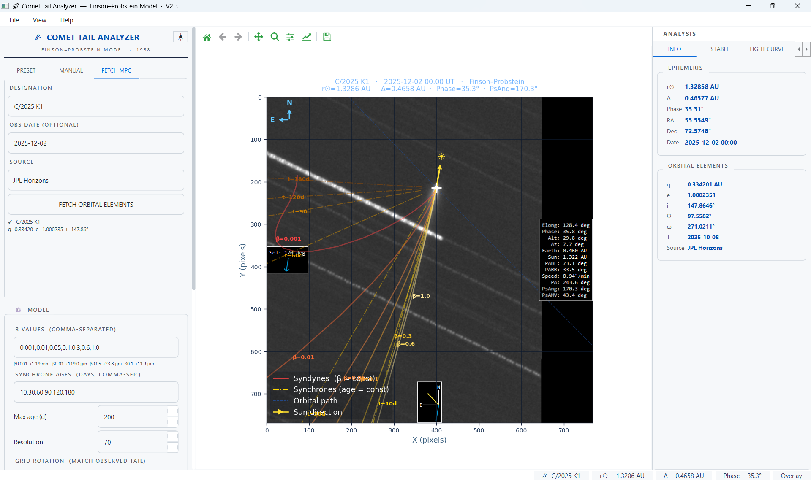

# ☄ Comet Tail Analyzer (CTA) v3.1

[](https://github.com/MPC-O58/Comet-Tail-Analyzer/releases/latest)
[](https://doi.org/10.3847/2515-5172/ae6f90)
[](LICENSE)
[](https://www.python.org/)
[](https://www.riverbankcomputing.com/software/pyqt/)
[](#author)

**Comet Tail Analyzer (CTA)** is an open-source desktop application for forward modeling and interpretation of cometary dust-tail morphology. It combines:

- the classical **Finson–Probstein syndyne–synchrone framework**;
- a configurable **Monte Carlo dust morphology model**;
- direct comparison with **FITS, PNG, and JPEG observations**;
- live observing geometry from **JPL Horizons**;
- optional **COBS light-curve and Q(t) support**;
- reproducible model inputs, reports, and publication-oriented figures.

CTA is designed for amateur and professional comet observers who want to connect observed dust structures with plausible particle sizes, emission ages, production histories, velocities, and ejection geometries.

> **Scientific scope**
>
> CTA is a morphology-first forward-modeling tool. A visually good match does not prove that one parameter set is unique. Grain size, release time, velocity, production history, viewing geometry, and image processing can be degenerate. Results should normally be reported as acceptable parameter ranges under stated assumptions.

---

## Download

### Windows installer or portable package

Download the current release from:

**[GitHub Releases](https://github.com/MPC-O58/Comet-Tail-Analyzer/releases/latest)**

- **Installer:** recommended for normal Windows use.

### Full user guide

**[CTA User Guide v3.1](docs/CTA_User_Guide_v3.1_EN_Updated.docx)**

The guide covers the physical model, image preparation, F-P interpretation, Monte Carlo workflow, Q(t), troubleshooting, reproducibility, and publication-figure export.

---

## Highlights of v3.1

### Monte Carlo dust morphology

- Grain-radius interval \(a_{\min}\) to \(a_{\max}\)
- Differential size distribution

\[
\frac{dN}{da} \propto a^{k_s}
\]

- Ejection-speed law

\[
V = V_0\,\beta^\gamma\,r_H^{-m}
\]

- Actual grain-speed range displayed in the overlay and report
- Isotropic, sunward-hemisphere, and rotating active-area ejection
- Solar-zenith-angle dependence for anisotropic emission
- Fixed random seed for reproducible sensitivity tests
- Percentile and calibrated surface-brightness contours
- Fast contour re-extraction without re-running particle trajectories

### F-P and Q(t) workflow

- Maximum dust age derived from the largest listed synchrone
- User-entered **Dominant dust age** for morphology guidance
- Embedded Q(t) preview in the MC Simulation tab
- COBS-derived relative activity weighting
- Coverage-quality guard against disconnected or stale COBS observations
- Manual dust-production table and steady-production mode
- F-P age guidance used as lower/upper bounds for MC release-window suggestions

### Reproducibility

- Save and load editable `.mcin` Monte Carlo input files
- Comet-mismatch warning when loading an input file
- Fixed-seed runs
- Preview and save a structured MC report
- Report filename defaults to `MC_Report_...`
- Software version, assumptions, speed range, Q(t), phase law, and ejection mode recorded

### Publication output

The MC Display tab provides three presentation modes:

1. **Analysis Overlay**  
   Keeps the comet image and diagnostic overlays for interactive analysis.

2. **Contour Comparison**  
   Uses a white background with observed isophotes in black and MC contours in magenta.

3. **Publication Figure**  
   Applies publication-oriented line weights, projected-distance axes, and clean annotation defaults.

Figures can be exported directly as:

- PNG
- TIFF
- PDF
- SVG

A grayscale-safe option uses solid observed contours and dashed model contours.

### Interface and workflow improvements

- Main window opens maximized
- Initial panel sizes adapt to the available display
- Splitter panels remain manually adjustable
- **File → Run F-P Model** with shortcut **F5**
- Image Setup stays above CTA only, not above unrelated applications
- FITS `DATE-OBS` retains time-of-day precision
- FITS header viewer
- Persistent plot zoom during model redraws
- Manual and automatic update checking through GitHub Releases

---

## Core capabilities

| Area | Capability |
|---|---|
| Finson–Probstein model | Configurable syndynes, synchrones, β values, release ages, optional non-zero ejection velocity |
| Monte Carlo model | Size distribution, release history, speed law, directional emission, phase law, density-weighted morphology |
| Image support | FITS, PNG, JPEG; WCS-assisted or manual plate-scale/orientation setup |
| Image diagnostics | Stretch controls, nucleus selection, isophotes, Sun direction, anti-velocity direction, compass |
| Observing geometry | Live orbital elements and ephemeris from JPL Horizons |
| Photometric support | COBS light curve, H₀/n fit, Afρ anchors, relative Q(t), rough dust-production calculator |
| Physical calculators | β-to-grain-radius and Afρ/dust-production calculators |
| Orbit context | Three-dimensional orbit-position diagram with inner-Solar-System zoom |
| Animation | Time-dependent F-P morphology animation |
| Reproducibility | `.mcin` files, fixed seed, MC report, data export |
| Publication | Contour-only comparison and PNG/TIFF/PDF/SVG export |
| Themes | Dark and light application themes |

---

## Screenshots

### Main interface


### Image overlay



### COBS light curve


### Dust analysis


---

## Quick start

### 1. Install from source

```bash
git clone https://github.com/MPC-O58/Comet-Tail-Analyzer.git
cd Comet-Tail-Analyzer
```

Create a virtual environment:

```bash
python -m venv .venv
```

Activate it on Windows:

```bat
.venv\Scripts\activate
```

Activate it on Linux or macOS:

```bash
source .venv/bin/activate
```

Install the dependencies:

```bash
python -m pip install --upgrade pip
pip install -r requirements.txt
```

Run CTA:

```bash
python CometTailGUI.py
```

`CometTailGUI.py` and `comet_tail_analyzer.py` must remain in the same source folder.

### 2. Basic F-P workflow

1. Select a preset comet or enter a designation.
2. Set the observation midpoint in UT.
3. Fetch the orbit from JPL Horizons.
4. Load and calibrate the image.
5. Enter β values and synchrone ages.
6. Press **F5** or click **COMPUTE MODEL**.
7. Compare the observed structure with the F-P curves.
8. Enter a defensible Dominant dust age before opening the MC workflow.

### 3. Basic MC workflow

1. Open **View → Monte Carlo morphology…**
2. Review the F-P Guide.
3. Set the grain-radius range and size-distribution slope.
4. Begin with steady production, isotropic emission, and a fixed seed.
5. Start with zero or conservative ejection velocity.
6. Run a moderate particle count for setup.
7. Refine the release window, grain population, and speed law one parameter family at a time.
8. Increase the particle count only after the parameter ranges are sensible.
9. Save the `.mcin` file and MC report.
10. Use **Publication Figure** only after checking the result in **Analysis Overlay**.

---

## Interpreting the models

### Finson–Probstein layer

The radiation-pressure parameter is

\[
\beta = \frac{F_{\mathrm{rad}}}{F_{\mathrm{grav}}}.
\]

- Larger β generally corresponds to smaller grains with a higher area-to-mass ratio.
- Smaller β generally corresponds to larger grains that remain closer to the projected orbital path.
- A **syndyne** connects particles with the same β released at different times.
- A **synchrone** connects particles released at the same time with different β values.

CTA converts β to an equivalent spherical grain radius using an assumed bulk density and \(Q_{\mathrm{pr}}\). This is an estimate, not a direct grain measurement.

### Monte Carlo layer

The MC model samples a population of grains over:

- radius;
- emission time;
- production weighting;
- ejection speed;
- direction;
- phase-function and albedo assumptions.

The result is a synthetic projected dust distribution that can be compared with observed isophotes.

A broader or longer modeled feature may be produced by several different changes, including:

- a longer release window;
- smaller, higher-β grains;
- faster ejection;
- a steeper size distribution;
- anisotropic emission;
- projection geometry.

Change one parameter family at a time and retain a fixed seed while testing sensitivity.

---

## Presentation modes

| Mode | Background | Intended use |
|---|---|---|
| Analysis Overlay | Comet image | Check real structures, stars, gradients, artifacts, vectors, and model context |
| Contour Comparison | White | Compare observed and modeled morphology clearly |
| Publication Figure | White | Export a clean scientific figure with projected-distance axes |

Default publication convention:

- **Black solid contours:** observed image isophotes
- **Magenta solid contours:** Monte Carlo model
- **Black dashed model contours:** optional grayscale-safe mode

> Switching presentation modes does not re-run the MC model and does not alter any physical parameter.

---

## Input and output files

| File or format | Purpose |
|---|---|
| FITS | Scientific image, WCS, observation time, and pixel data |
| PNG/JPEG | Processed image overlay with manual calibration |
| `.mcin` | Editable Monte Carlo input configuration |
| MC report `.txt` | Human-readable assumptions and result summary |
| CSV | Exported F-P model points or analysis data |
| PNG/TIFF | Raster publication and presentation output |
| PDF/SVG | Vector contour output |

For a reproducible analysis, archive together:

- original and processed FITS files;
- `.mcin` input;
- MC report;
- exported figure;
- image-reduction notes;
- CTA version;
- external photometric or Afρ sources.

---

## COBS and network access

COBS access is optional. CTA can run F-P and Monte Carlo models without COBS.

COBS may be unavailable when:

- the computer is offline;
- the service is temporarily unavailable;
- a firewall, proxy, antivirus, or managed corporate network blocks the request.

In that case, use:

- steady production;
- a manual release window;
- a manual dust-production table;
- manually entered H₀/n or Afρ information when available.

COBS photometry should be treated primarily as a **relative activity prior**. Heterogeneous apertures, filters, observers, and observing methods mean that it is not automatically a unique physical dust-mass-loss history.

---

## Requirements

CTA source requires **Python 3.10 or later**.

Main dependencies include:

- PyQt6
- NumPy
- SciPy
- Matplotlib
- Astropy
- Astroquery
- Pillow
- Requests

Install the tested dependency set with:

```bash
pip install -r requirements.txt
```

---

## Project structure

```text
Comet-Tail-Analyzer/
├── CometTailGUI.py             # PyQt6 desktop interface
├── comet_tail_analyzer.py      # F-P and Monte Carlo physics engine
├── requirements.txt
├── LICENSE
├── README.md
├── build_installer.bat         # Windows installer/portable build workflow, when included
└── docs/
    ├── CTA_User_Guide_v3.1_EN_Updated.docx
    ├── screenshot_dark.png
    ├── screenshot_dark_FP.png
    ├── screenshot_light.png
    ├── screenshot_lc.png
    └── screenshot_analysis.png
```

---

## Scientific limitations

CTA v3.1 does not currently provide:

- a unique automatic inverse solution for all dust parameters;
- ion-tail or plasma modeling;
- full inner-coma gas-drag hydrodynamics;
- grain fragmentation or sublimation after release;
- Lorentz-force propagation for charged submicron grains;
- planetary perturbations in the standard heliocentric two-body dust model;
- non-spherical optical scattering calculations;
- automatic multi-epoch simultaneous optimization.

The software is most reliable when used to test clearly stated hypotheses and parameter ranges rather than to claim one exact solution.

---

## Citation

When CTA contributes to a scientific result, cite the software paper:

> **Thaluang, T. 2026, “Comet Tail Analyzer: A GUI Tool for Finson–Probstein Dust-tail Modeling,” Research Notes of the AAS, 10, 126.**  
> DOI: [10.3847/2515-5172/ae6f90](https://doi.org/10.3847/2515-5172/ae6f90)

BibTeX:

```bibtex
@article{Thaluang2026CTA,
  author  = {Thaluang, Teerasak},
  title   = {Comet Tail Analyzer: A GUI Tool for Finson--Probstein Dust-tail Modeling},
  journal = {Research Notes of the AAS},
  volume  = {10},
  number  = {5},
  pages   = {126},
  year    = {2026},
  doi     = {10.3847/2515-5172/ae6f90}
}
```

For reproducibility, also state:

- CTA version;
- observation epoch;
- β and synchrone ranges;
- grain density and \(Q_{\mathrm{pr}}\);
- size distribution;
- release window and Q(t) source;
- \(V_0\), \(\gamma\), and \(m\);
- ejection-direction model;
- particle count and random seed;
- phase law and albedo;
- contour mode and levels.

Suggested wording:

> The CTA model provides a morphology-consistent solution under the stated grain-density, size-distribution, velocity, production-history, and ejection-direction assumptions. Because these parameters are degenerate, the result is interpreted as an acceptable parameter range rather than a unique inversion.

---

## Attribution

Selected Monte Carlo components are ported from **py_COMTAILS** by Fernando Moreno, Rafael Morales, and Nicolás Robles, IAA-CSIC, under the MIT License:

- Schleicher dust phase-function coefficients;
- sunward-hemisphere ejection-direction sampling;
- rotating active-area ejection direction.

Project:

[https://github.com/FernandoMorenoDanvila/py_COMTAILS](https://github.com/FernandoMorenoDanvila/py_COMTAILS)

All other CTA components—including the F-P engine, orbital mechanics, COBS integration, GUI, MC core loop, contour extraction, and publication display—are original to CTA unless otherwise identified in the source.

---

## References

- Finson, M. J., & Probstein, R. F. 1968a, *ApJ*, 154, 327
- Finson, M. J., & Probstein, R. F. 1968b, *ApJ*, 154, 353
- Burns, J. A., Lamy, P. L., & Soter, S. 1979, *Icarus*, 40, 1
- A'Hearn, M. F., et al. 1984, *AJ*, 89, 579
- Schleicher, D. G., Millis, R. L., & Birch, P. V. 1998, *Icarus*, 132, 397
- Ishiguro, M. 2008, *Icarus*, 193, 96
- Hui, M.-T., et al. 2020, *AJ*, 159, 77
- Moreno, F. 2022, *Universe*, 8, 366
- Moreno, F. 2025, *A&A*, 695, A263

---

## License

CTA is released under the **MIT License**. See [LICENSE](LICENSE).

---

## Author

**Teerasak Thaluang**  
MPC Observatories **O51** and **O58**, Thailand  
ORCID: [0009-0009-6074-8233](https://orcid.org/0009-0009-6074-8233)

---

## Support and contributions

Use GitHub Issues for reproducible bug reports and feature requests:

[https://github.com/MPC-O58/Comet-Tail-Analyzer/issues](https://github.com/MPC-O58/Comet-Tail-Analyzer/issues)

A useful issue report should include:

- CTA version;
- operating system;
- installer, portable, or source installation;
- comet designation and observation date;
- exact error message;
- steps to reproduce;
- screenshot or log when available;
- relevant `.mcin` file without sensitive information.
